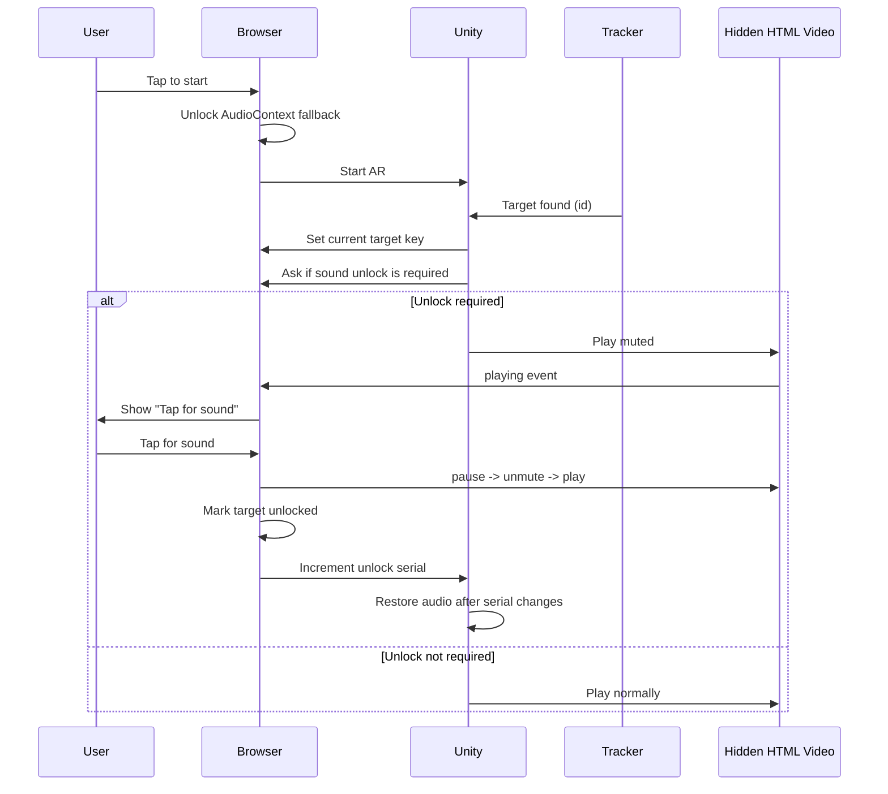

# iOS WebGL Sound Fix Implementation

## Purpose

This document explains what was changed in this project to make Unity WebGL AR videos behave more reliably on iPhone and iPad, especially when:

- the first tracked image plays video but not audio
- a retracked image behaves differently from the first scan
- a second target in the same session does not get sound
- touching the screen suddenly makes video and audio start

This is the implementation note for the current codebase. The older background analysis remains in `iOS_Autoplay_Fix.md`.

## Problem Summary

### What worked

- Android video and audio playback worked normally.
- Desktop browser behavior was much more forgiving.
- The webcam feed was already working because it was `muted` and `playsinline`.

### What failed on iOS

- AR content video sometimes started without audio.
- Sometimes the first target worked, but the second target in the same session did not.
- Sometimes retracking the same target played video but not audio.
- In some cases nothing resumed until the user touched the screen.

### Why this happens

Unity WebGL `VideoPlayer` uses a hidden browser `<video>` element. On iOS Safari, audible media is more tightly controlled than on Android. In this project, AR tracking callbacks, Unity `OnEnable()`, and `prepareCompleted` callbacks are not the same thing as a direct browser gesture.

That means:

- Unity may think it asked the video to play.
- The hidden browser video may start muted.
- Audio may remain blocked until a real touch happens.
- Retrack behavior can be inconsistent if the browser-side state is not mapped to the current AR target.

## Final Fix Goals

The implementation was changed to support this behavior:

1. Show a real `Tap to start` gate on Apple mobile browsers before AR boot.
2. Let content video begin in a muted-safe path if sound still needs user interaction.
3. Show `Tap for sound` only when needed.
4. Track sound unlock state by AR target key, not just by global session.
5. Do not mark a target as unlocked until replay with sound actually succeeds.
6. Keep the browser and Unity sides in sync about which target is currently playing.

## Files Changed

### Unity / C#

| File | Purpose |
| --- | --- |
| `Assets/Scripts/CDNARVideoController.cs` | Main autoplay fallback, target key sync, mute/unmute restore flow |
| `Assets/Imagine/ImageTracker/Scripts/ImageTracker.cs` | Broadcasts the tracked target id into child objects when tracking is found |

### WebGL JS bridge

| File | Purpose |
| --- | --- |
| `Assets/Imagine/Common/Plugins/Helpers.jslib` | Exposes browser sound-unlock state and current target key to Unity |

### Templates

| File | Purpose |
| --- | --- |
| `Assets/WebGLTemplates/iTracker/index.html` | Main browser-side sound unlock logic |
| `Assets/WebGLTemplates/iTracker6/index.html` | Same logic for the PWA template |
| `Assets/WebGLTemplates/iTracker6/sw.js` | Cache version bump so template changes are not masked by old cached HTML |

### Mirrored build outputs

| File | Purpose |
| --- | --- |
| `WebGLBuild_Visiting_Card/index.html` | Built output kept in sync with template changes |
| `Build_BookCover/AR_Build/index.html` | Built output kept in sync with template changes |

## Architecture Overview



## Detailed Implementation

### 1. Unity side: `CDNARVideoController.cs`

### New browser interop methods

The controller now imports three WebGL functions:

- `GetWebGLSoundUnlockSerial()`
- `RequiresWebGLSoundUnlock()`
- `SetWebGLCurrentTargetKey(string targetKey)`

These allow Unity to:

- know whether the browser currently needs a sound unlock
- identify which AR target is currently requesting playback
- wait until the browser confirms that a new unlock gesture happened

### New target key field

A new field was added:

- `public string webGLSoundTargetKey;`

If left empty, the controller derives it automatically from the parent target object or the current GameObject name.

This matters because the browser-side memory is now keyed by target, not just by a single global boolean.

### Playback flow change

The old flow was effectively:

1. call `videoPlayer.Play()`
2. hope iOS allows video and audio

The new flow is:

1. send the current target key to the browser with `SetWebGLCurrentTargetKey(webGLSoundTargetKey)`
2. ask `RequiresWebGLSoundUnlock()`
3. if browser says unlock is still needed:
   - capture the current unlock serial
   - mute Unity-side audio output
   - start playback
   - wait until browser unlock serial changes
   - restore audio once playback is already running and a new unlock happened
4. if no unlock is needed:
   - play normally

This logic lives inside `PlayVideoWithWebGLAutoplayFallback()`.

### Why the order matters

One earlier bug was checking `RequiresWebGLSoundUnlock()` before telling the browser which target was active. That forced the browser into a global decision instead of a target-specific one.

The corrected order is:

1. set target key
2. ask whether unlock is needed

### Audio restore coroutine

`RestoreAudioAfterPlaybackStarts()` waits for two things:

- the `VideoPlayer` must actually be playing
- the browser unlock serial must change if the play started in a muted fallback path

Only then does Unity restore audio with `ApplyWebGLAutoplayMute(false)`.

### Target updates from tracking

`OnWebGLTargetTrackingStateChanged(string targetId)` updates `webGLSoundTargetKey` dynamically when the current tracking id becomes known.

### 2. Tracker side: `ImageTracker.cs`

When a target is found, the tracker now broadcasts the tracking id into the target hierarchy:

```csharp
targets[id].transform.gameObject.BroadcastMessage(
    "OnWebGLTargetTrackingStateChanged",
    id,
    SendMessageOptions.DontRequireReceiver
);
```

This is what allows `CDNARVideoController` instances under that target to know which target key they should use for sound unlock state.

Without this broadcast, Unity would have much weaker target context on the WebGL side.

### 3. JS bridge: `Helpers.jslib`

The WebGL bridge now exposes browser-side sound state to Unity.

### `GetWebGLSoundUnlockSerial()`

Returns:

- `window.__AR_SOUND_UNLOCK_SERIAL || 0`

Unity uses this to detect that a new real browser-side unlock gesture occurred.

### `RequiresWebGLSoundUnlock()`

This function is now target-aware.

It works like this:

- if the browser does not require a gesture, return `0`
- if there is no current target key yet, return `1`
- otherwise look up `window.__AR_TARGET_SOUND_UNLOCKS[targetKey]`
- return `1` only if this target still needs sound unlock

### `SetWebGLCurrentTargetKey(targetKey)`

Stores the active target key in:

- `window.__AR_CURRENT_TARGET_KEY`

This is the connection point between Unity target tracking and browser-side prompt logic.

### 4. Browser side: WebGL templates

The main browser logic was added to:

- `Assets/WebGLTemplates/iTracker/index.html`
- `Assets/WebGLTemplates/iTracker6/index.html`

The same logic was then mirrored into the checked-in build folders.

### Added overlays

Two browser-level overlays now exist:

- `Tap to start`
- `Tap for sound`

`Tap to start` is used before AR boot on Apple mobile browsers.

`Tap for sound` is used for content video elements when the current target still needs a sound unlock.

### Added browser state variables

The templates now use these globals:

- `window.__AR_REQUIRE_SOUND_GESTURE`
- `window.__AR_SOUND_UNLOCK_SERIAL`
- `window.__AR_CURRENT_TARGET_KEY`
- `window.__AR_TARGET_SOUND_UNLOCKS`

These are the shared state between browser JS and Unity C#.

### Inline playback enforcement

Every relevant video element is forced to support inline playback:

- `playsinline`
- `webkit-playsinline`
- `video.playsInline = true`

This is applied to:

- the webcam video
- dynamically created Unity content videos

### Detecting Unity's hidden content videos

The templates now:

- register existing video elements
- watch the DOM with `MutationObserver`
- patch `HTMLMediaElement.prototype.play`

This is important because Unity creates and manages the hidden content video element internally. The browser template cannot rely on a fixed id for that element.

### Content video registration

`RegisterContentVideo(videoElement)` now:

- ignores the webcam element
- ensures inline playback attributes exist
- assigns a target key to the hidden video
- adds a `playing` listener

When `playing` fires, the template checks whether this target still needs sound unlock. If yes, it stores that video as `currentSoundUnlockVideo` and shows the `Tap for sound` prompt.

### Sound prompt gating

`ShowSoundUnlockPrompt()` only displays the prompt if:

- this is an Apple mobile browser
- there is a pending content video
- that target has not already been unlocked

This is what makes the sound prompt session-aware and target-aware.

### 5. The critical first-time replay fix

One important bug in the earlier versions was this:

- the code tried to unmute a video that was already playing muted

That did not reliably convert the current playback into audible playback.

The corrected path in `OnUserTapEnableSound()` is:

1. get the pending content video
2. get its target key
3. increment `window.__AR_SOUND_UNLOCK_SERIAL`
4. unlock browser media playback fallback
5. `video.pause()`
6. mark `video.__arAllowNextPlayWithSound = true`
7. unmute the video
8. call `video.play()` again inside the tap handler
9. only after replay succeeds, mark `window.__AR_TARGET_SOUND_UNLOCKS[targetKey] = true`

This fixed two separate issues:

- the first-time sound action now applies to the current play attempt
- a target is no longer marked unlocked too early

### 6. Per-target unlock memory

The sound system is no longer global-only.

Current intended behavior:

- Target A, first time in session: ask for sound
- Target A, later in same session: do not ask again
- Target B, first time in session: ask again
- Target C, first time in session: ask again

The browser memory for this is:

- `window.__AR_TARGET_SOUND_UNLOCKS[targetKey]`

This is the core design improvement over the earlier session-wide approach.

## Runtime Flow

### Startup flow

1. Browser checks whether it is an Apple mobile browser.
2. If yes, `Tap to start` is shown instead of immediately starting AR.
3. The user taps start.
4. The browser attempts a lightweight media unlock with `AudioContext`.
5. Unity AR boot begins.

### First tracked target with sound requirement

1. Tracker finds target `A`.
2. `ImageTracker` broadcasts `OnWebGLTargetTrackingStateChanged("A")`.
3. `CDNARVideoController` sets browser current target key to `A`.
4. Unity asks if target `A` still needs sound unlock.
5. If yes, Unity starts playback muted.
6. Browser detects the content video play.
7. Browser shows `Tap for sound`.
8. User taps.
9. Browser pauses, unmutes, and replays the real hidden video element.
10. Browser marks target `A` as unlocked and increments unlock serial.
11. Unity sees the serial change and restores audio output.

### Same target later in the same session

Expected path:

1. Tracker finds target `A` again.
2. Unity sets current target key to `A`.
3. Browser says target `A` is already unlocked.
4. Video should not require the extra sound prompt for that target in the same browser session.

### Different target later in the same session

Expected path:

1. Tracker finds target `B`.
2. Unity sets current target key to `B`.
3. Browser sees no unlock memory for `B`.
4. `Tap for sound` is shown again.

## Key Bugs Fixed During Iteration

The final implementation came from multiple debugging rounds. These were the main fixes:

### Iteration 1: Add `Tap to start`

Added a real browser gesture before AR boot.

### Iteration 2: Mute-first fallback in Unity

Allowed content video to begin even when sound was still locked.

### Iteration 3: Track the hidden browser video element

Patched browser-side video handling instead of assuming Unity's C# state alone was enough.

### Iteration 4: Add unlock serial tracking

Unity now waits for a browser-confirmed gesture event rather than guessing.

### Iteration 5: Move from global unlock to per-target unlock

Different targets now have separate sound memory in one session.

### Iteration 6: Fix first-time replay bug

Changed the sound unlock path to:

- pause
- unmute
- replay inside the same tap

instead of just trying to unmute an already muted playback.

### Iteration 7: Fix target-key order bug

Changed the order so Unity sets the current target key before asking whether sound unlock is required.

### Iteration 8: Delay unlock memory until replay success

Stopped marking a target as unlocked before the replay with sound actually succeeded.

## Cache and Deployment Notes

### `iTracker6` service worker

`Assets/WebGLTemplates/iTracker6/sw.js` cache name was bumped during debugging so Safari would not keep serving stale HTML and JS.

Current value:

```js
var CACHE_NAME = 'itracker6-cache-v7';
```

### Why this matters

During iPhone testing, template fixes can appear "not working" if Safari is still using older cached HTML or service-worker-controlled responses.

### Recommended iPhone retest steps

1. Rebuild or redeploy the updated HTML.
2. Open the site over HTTPS.
3. Hard refresh the page.
4. For `iTracker6`, clear Safari website data once after template/service-worker changes.
5. Retest first target, same target retrack, and different target in the same session.

## Testing Checklist

Use this checklist on a real iPhone or iPad:

- `Tap to start` appears before AR boot.
- Camera permission still works.
- First target shows video.
- First target shows `Tap for sound` when needed.
- After tapping for sound, video becomes audible.
- Same target retrack behaves consistently in the same session.
- Different target asks for sound the first time it appears.
- No old cached behavior remains after Safari data is cleared.

## Important Notes for Future Changes

If this logic is updated again, keep these rules:

1. Do not assume Unity `VideoPlayer.Play()` equals browser-approved audible playback.
2. Do not mark a target as sound-unlocked before replay succeeds.
3. Always set the browser's current target key before checking sound-unlock state.
4. Keep template changes and checked-in build outputs in sync.
5. If `iTracker6` HTML changes again, update the service worker cache version.

## Suggested Next Debug Step If Issues Continue

If playback still behaves differently on-device after this implementation, the next debugging step should be a small on-screen debug overlay that prints:

- current target key
- whether browser thinks unlock is needed
- current unlock serial
- whether a content video is pending sound unlock
- whether replay succeeded or failed

That would make future debugging deterministic instead of relying on indirect symptoms.

## Summary

The iOS fix in this project is no longer just a generic autoplay workaround. It is now a target-aware browser-and-Unity coordination layer that:

- detects which AR target is active
- decides whether that target still needs sound unlock
- starts playback safely when sound is still gated
- prompts for sound only when needed
- waits for browser-confirmed unlock before restoring Unity audio

This is the current implementation that ties together Unity, the WebGL template, and browser media state for iPhone/iPad behavior.
